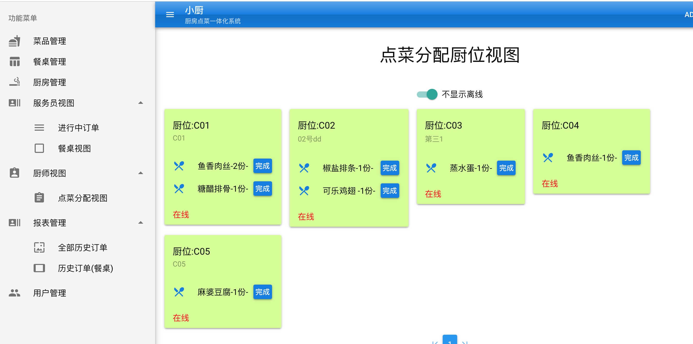
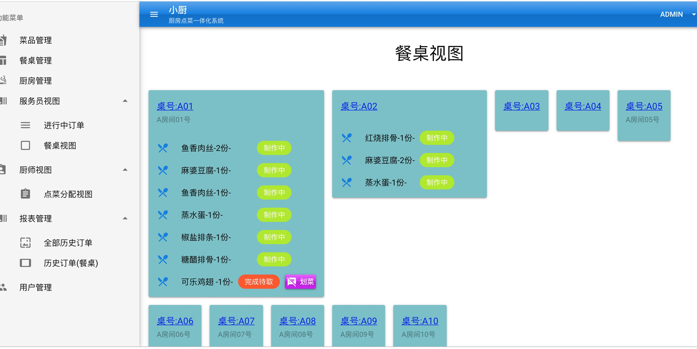
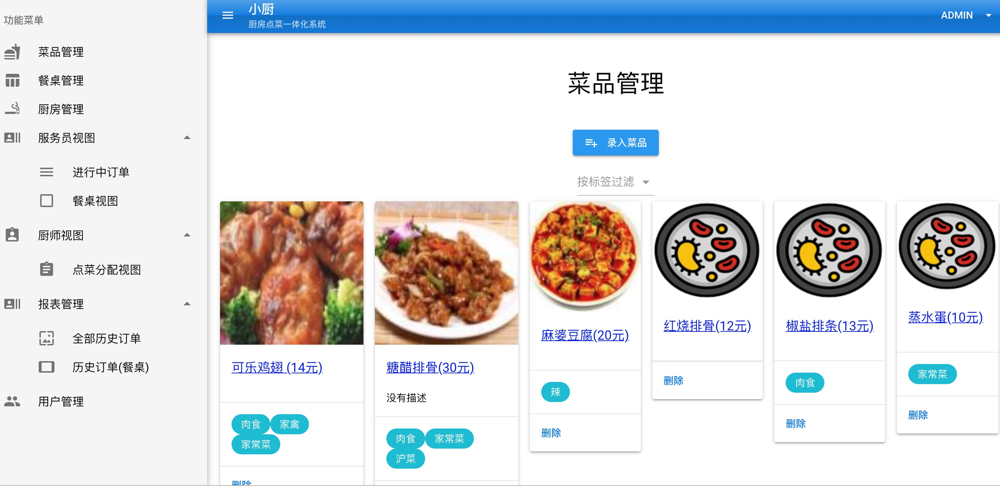
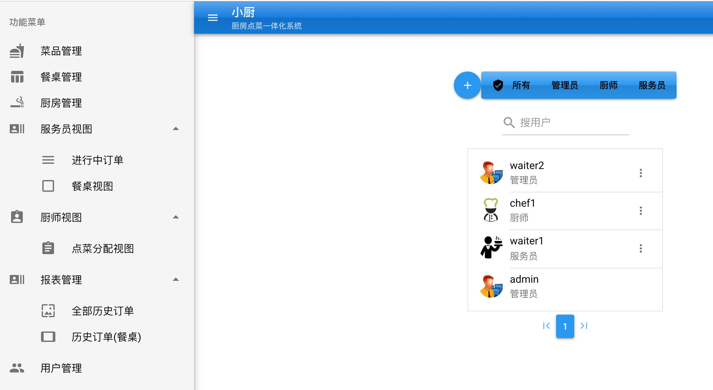
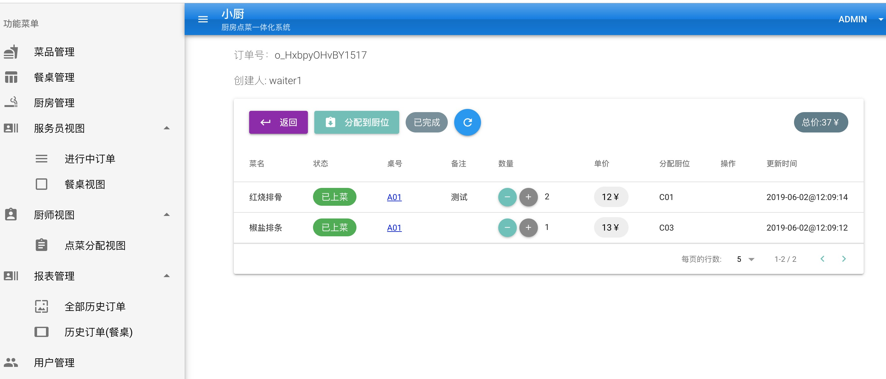
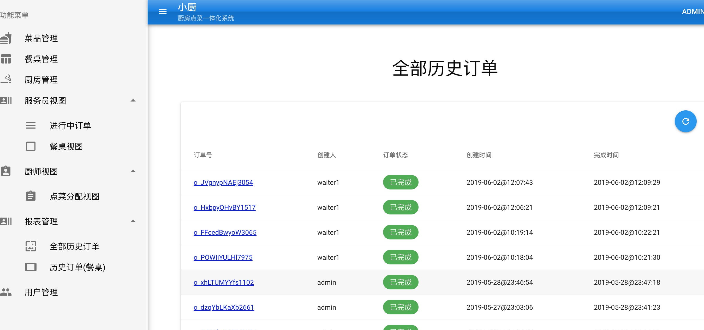

# chef-assist

## 功能说明
* 三种用户角色：餐厅服务员，后厨人员，管理员
* 服务员负责点菜录入，订单的建立和完成，菜品状态跟踪
* 后厨人员只负责看板做菜，做完菜更新菜品状态
* 管理员可以做菜品，厨位，餐桌，人员，订单等相关的一切操作

## 硬件要求
有浏览器能上网的任何终端皆可，手机，平板，电脑都行

## 适用场景
餐馆，酒店

## 技术
### 后台
java, springboot, mybatis, liquibase，mysql...
### 前端
VueJs框架之quasar

### 视频demo
 [视频演示](https://v.youku.com/v_show/id_XNDIxMTQ3NTAwMA==.html?spm=a2h3j.8428770.3416059.1 "视频演示")

## 厨房视图
点菜传菜一体系统

## 餐桌视图

## 菜品管理

## 用户管理

## 订单详情

## 历史订单

